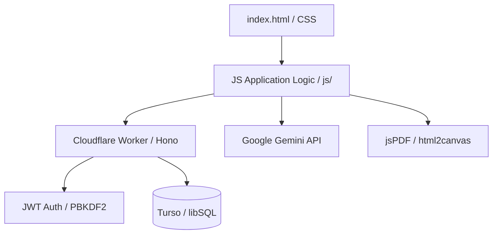

# TrainFlow

> A modern, lightweight Learning Management System (LMS) for professional teams, enabling AI-assisted course creation, targeted assignments, and verifiable certifications.

## What It Does
TrainFlow is a streamlined Learning Management System (LMS) designed for professional environments where rapid deployment and verifiable compliance are critical. It provides a comprehensive platform for managing the entire training lifecycle, from content ingestion to certification, with a focus on ease of use and modern aesthetics.

For **learners**, TrainFlow offers a clean, focused interface to access assigned training modules, engage with interactive content, and take quizzes to demonstrate mastery. Upon reaching the required passing threshold, learners can instantly generate and download professional, verifiable PDF certificates.

For **managers and admins**, the application provides powerful oversight and creation tools. Administrators can leverage the AI-powered content importer to transform markdown documentation into full training courses with generated summaries and quiz questions. Managers can track team compliance through a real-time dashboard, assign specific courses to individuals or groups, and export detailed completion records for audit purposes.

## Live Demo
[Live Demo](https://trainflow.example.com) (coming soon)

 *You can replace this with a real screenshot of the application's main dashboard.*

## Tech Stack
- **Framework:** Vanilla JavaScript (Frontend) / Hono `v4.7.0` (Edge Worker)
- **Build Tool:** Wrangler `v3.114.17`
- **Language:** JavaScript (ES6+)
- **Backend & DB:** Cloudflare Workers & Turso (using `@libsql/client` `v0.14.0`)
- **CSS:** Custom design token system with runtime-brandable CSS variables (Dark Enterprise SaaS theme)
- **Component Library:** Native HTML5 / Custom UI Components
- **Data Fetching:** Native Fetch API
- **Routing:** Hono (Backend) / State-based Screen Management (Frontend)
- **Icons:** Emoji-based System & CSS Graphics

## Architecture


TrainFlow utilizes a modern serverless architecture optimized for the edge. The frontend is a high-performance Single Page Application (SPA) built with vanilla JavaScript, which communicates with a Hono-powered API running on Cloudflare Workers. Turso (libSQL) serves as the primary relational database, providing global low-latency data access. Global UI state and screen transitions are managed by a centralized `App` object, while server state is handled through direct API calls and local caching. AI capabilities are integrated directly into the browser, allowing administrators to use their own Gemini API keys for content generation.

## Project Structure
```
js/           # Core application logic split by role (admin, manager, learner).
├── core.js   # Main application controller and state management.
├── auth.js   # JWT handling and authentication logic.
├── admin.js  # Administrative tools and dashboard logic.
├── manager.js# Team management and assignment logic.
├── learner.js# Course consumption and progress tracking.
├── builder.js# Interactive course creation tools.
worker/       # Cloudflare Worker (Hono API) and backend configuration.
├── index.js  # Main API routes, middleware, and DB interaction.
├── wrangler.toml # Cloudflare Workers deployment configuration.
css/          # Modular CSS and theme definitions.
├── style.css # Main design system and layout rules.
scripts/      # Utility scripts for development and maintenance.
schema.sql    # Database schema for Turso / libSQL.
```

## Key Features
- **AI Course Importer:** A specialized interface that parses Markdown files and uses the Google Gemini API to automatically generate module summaries and multiple-choice quiz questions.
- **Verifiable PDF Certificates:** A client-side generation engine using `html2canvas` and `jspdf` that produces high-quality, branded certificates with unique IDs and secure metadata.
- **Compliance Dashboard:** Real-time data visualization for administrators and managers, providing instant insights into pass rates, enrollment gaps, and recent completions.
- **Role-Based Access Control:** Secure, tiered access for Admins (global), Managers (team-specific), and Learners, implemented using JWT-signed tokens and secure PBKDF2 password hashing.

## Getting Started
### Prerequisites
- Node.js (v18+)
- Wrangler CLI (`npm install -g wrangler`)
- Turso CLI (for database management)

### Installation
1.  Clone the repository: `git clone ...`
2.  Install worker dependencies: `cd worker && npm install`
3.  Deploy the database schema: `turso db shell <your-db-name> < schema.sql`

### Environment Variables
To enable full functionality, create a `.env` file (for local dev) or set Wrangler secrets for the worker.

```
# Cloudflare Worker Secrets
TURSO_URL="libsql://your-db-name.turso.io"
TURSO_TOKEN="..."
JWT_SECRET="..."
ADMIN_PASSWORD_HASH="..." # Generate via scripts/hash-password.mjs

# Frontend (Session Storage)
# GEMINI_API_KEY is provided via the UI during AI Import
```

### Running Locally
1.  Start the local worker: `cd worker && npm run dev`
2.  Serve the root directory: `npx serve .` (or any static file server)
3.  Open your browser to `http://localhost:3000` (or your static server port).
4.  The worker will be available at `http://localhost:8787`.

## Database Schema
The system uses a libSQL (SQLite-compatible) schema managed via Turso.

**Table: `users`**
| Column | Type | Description |
|---|---|---|
| `id` | `TEXT` | Primary Key (UID). |
| `name` | `TEXT` | Display name (Unique). |
| `role` | `TEXT` | Role: `manager` or `learner`. |
| `team_id` | `INTEGER` | FK to `teams`. |

**Table: `courses`**
| Column | Type | Description |
|---|---|---|
| `id` | `TEXT` | Primary Key (UID). |
| `title` | `TEXT` | Course title. |
| `icon` | `TEXT` | Emoji icon representation. |
| `description`| `TEXT` | Course summary for learners. |

**Table: `completions`**
| Column | Type | Description |
|---|---|---|
| `id` | `TEXT` | Primary Key (UID). |
| `course_id` | `TEXT` | FK to `courses`. |
| `score` | `INTEGER` | Final quiz score percentage. |
| `cert_id` | `TEXT` | Unique verifiable certificate ID. |

## Edge Functions
The backend logic is consolidated into a Hono application running on Cloudflare Workers (Edge).

| Route | Method | Purpose | Auth Required? |
|---|---|---|---|
| `/api/auth/login` | `POST` | Authenticates users and returns a JWT. | No |
| `/api/admin/stats` | `GET` | Aggregates global or team-level training statistics. | Yes (Admin/Manager) |
| `/api/admin/teams` | `GET` | Retrieves all organizational units and member counts. | Yes (Admin) |
| `/api/learners` | `GET` | Fetches filtered learner lists and progress data. | Yes (Manager) |

## 🎨 Design System

**Theme:** Dark enterprise SaaS. Inspired by Linear, Vercel, and Rippling.

**Fonts:**
- UI & Body: Inter (300, 400, 500, 600) via Google Fonts
- Monospace / Data: JetBrains Mono (400, 500) via Google Fonts

**Design Tokens (css/style.css :root):**
- Fixed structural tokens: `--bg`, `--bg-2`, `--surface`, `--surface-2`, `--border`, `--border-2`
- Text tokens: `--ink-1` through `--ink-4`
- Status tokens: `--success`, `--warning`, `--danger`
- **Brandable tokens** (controlled via Admin → Branding panel, update entire UI live):
  - `--brand` — primary accent color (buttons, active states, highlights)
  - `--brand-dark` — computed darker variant (hover states)
  - `--brand-glow` — computed ambient fill at 15% opacity
  - `--shadow-brand` — computed focus ring at 20% opacity

**Branding:**
The Admin branding panel controls `--brand`. Changes are applied instantly via
`document.documentElement.style.setProperty()` and persisted to:
- `localStorage('trainflow_brand_color')` — survives page reload
- Worker backend via `PUT /api/brand`

On app load, the saved brand color is restored before first render.

**Component patterns:**
- Cards: `var(--surface)` background, 1px `var(--border)` border, `var(--radius-lg)`
- Buttons: `.btn-primary` uses `var(--brand)`, `.btn-outline` uses `var(--border-2)`, etc.
- Tables: monospace headers, `var(--border)` row dividers, hover highlight only
- Badges/Chips: font-mono, uppercase, 11px, colored background at 10% opacity

## Configuration
- **`wrangler.toml`:** Configures the Cloudflare Worker environment, including compatibility dates and service bindings.
- **`js/core.js`:** Contains the global `App` configuration, including API endpoints and UI state defaults.
- **`css/style.css`:** The source of truth for all branding, including the color palette and typography defined in the `:root` selector.

## Deployment
1.  **Database:** Push the schema to Turso using the Turso CLI.
2.  **Backend:** Deploy the Cloudflare Worker using `wrangler deploy` from the `worker/` directory.
3.  **Frontend:** The root directory contains static files (`index.html`, `js/`, `css/`). These can be deployed to Cloudflare Pages, GitHub Pages, or any static hosting provider.
4.  **Secrets:** Ensure `JWT_SECRET` and `ADMIN_PASSWORD_HASH` are set in the Cloudflare Dashboard.

## Known Limitations
- **AI Importer:** Currently optimized for Markdown input; direct PDF or Word ingestion is not yet supported.
- **Storage:** PDF certificates are generated on-demand and not stored as blobs; only completion metadata and unique IDs are persisted.
- **Real-time:** The application uses a polling/manual refresh model for dashboard updates rather than WebSockets.

## Contributing
Contributions are welcome. Please ensure that all new features include appropriate error handling and follow the established modular JS pattern. Code should be formatted according to the project's existing style (2-space indentation, clear commenting). For major changes, please open an issue first to discuss the proposed architecture.
