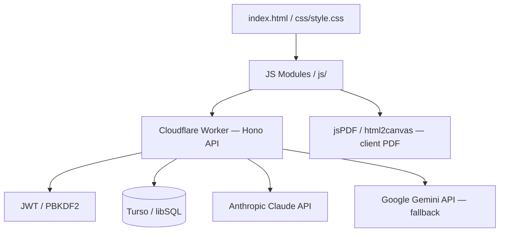

# TrainFlow

> A modern, lightweight Learning Management System (LMS) for professional teams — AI-assisted course creation, role-based access, targeted assignments, progress tracking, and verifiable certifications.

## Live App
[https://theronv.github.io/trainingflow/](https://theronv.github.io/trainingflow/)

---

## What It Does

TrainFlow is a full-stack LMS designed for professional environments where rapid deployment and verifiable compliance matter. It covers the entire training lifecycle — from AI-assisted content ingestion to learner certification — with three distinct role-based portals.

**Admins** manage the entire platform: create and organise courses into sections, import content via AI, manage all users and teams, configure branding, and export compliance data.

**Managers** oversee their assigned team: track completion rates, assign courses with optional due dates, import learners in bulk via CSV, and reset passwords.

**Learners** work through assigned courses module by module, receive real-time quiz feedback, and generate downloadable PDF certificates on passing.

---

## Tech Stack

| Layer | Technology |
|---|---|
| Frontend | Vanilla JavaScript (ES6+), HTML5, CSS3 |
| Edge Worker | [Hono](https://hono.dev/) v4.7.0 on Cloudflare Workers |
| Database | Turso (libSQL / SQLite-compatible) via `@libsql/client` v0.14.0 |
| Deployment | Wrangler v3.114.17, GitHub Pages (frontend) |
| AI — Primary | Anthropic Claude API (`claude-haiku-4-5-20251001`) via Worker |
| AI — Fallback | Google Gemini 1.5 Flash via Worker |
| PDF Generation | `jsPDF` + `html2canvas` (client-side) |
| Auth | JWT + PBKDF2 password hashing |

---

## Architecture



The frontend is a Single Page Application served from GitHub Pages. All API calls route through a Hono worker on Cloudflare Workers. AI content generation happens server-side (worker calls Claude → Gemini fallback), not in the browser. The database is Turso (globally distributed libSQL).

---

## Project Structure

```
index.html          # Single-page app shell — all screens, modals, overlays
css/
└── style.css       # Full design system — tokens, components, dark/light themes
js/
├── core.js         # Global state, API helpers, applyBrand(), config constants
├── auth.js         # Login/register flows for all three roles
├── admin.js        # Admin portal — courses, users, teams, branding, importer
├── manager.js      # Manager portal — team, assignments, CSV import
├── learner.js      # Learner portal — course player, quiz engine, certificates
├── builder.js      # Course builder — module/question editor
└── app.js          # AppProxy — wires HTML onclick attributes to JS; theme toggle
worker/
├── index.js        # All Hono API routes and DB logic
└── wrangler.toml   # Cloudflare Worker configuration
schema.sql          # Initial database schema
```

---

## Features

### Admin Portal
- **Dashboard** — global stats: total learners, completions this month, pass rate, overdue count; recent activity table; trouble-spot reporting
- **Course Management** — create, edit, delete courses; assign courses to sections; emoji icons per course
- **Course Sections** — group courses into named sections for organised browsing across all portals
- **AI Content Importer** — upload a Markdown file, provide a Claude or Gemini API key, generate module summaries + multiple-choice quizzes with explanations; full review step before saving
- **Course Builder** — manual course creation with rich module/question editor
- **Learner Management** — add, edit, delete, and move learners between teams; search/filter; reset passwords
- **Team Management** — create teams, add managers manually, generate invite codes for manager self-registration
- **Completions** — paginated completion log with course, score, pass/fail, date; CSV export
- **Branding** — live-preview org name, logo (URL or file upload), primary/secondary colour pickers, pass threshold; changes propagate instantly across all portals
- **Settings** — admin password change, data backup export

### Manager Portal
- **Dashboard** — team-scoped stats and recent activity
- **Courses** — browse all courses grouped by section; assign to entire team with optional due date
- **Team** — view members, completion counts, overdue flags; reset member passwords
- **CSV Bulk Import** — upload a CSV to create multiple learners at once; downloadable template; validation preview before import
- **Completions** — team-scoped completion records

### Learner Portal
- **Course Catalogue** — courses grouped by section; "In Progress" chip on started courses
- **Course Player** — module-by-module content with progress restored between sessions
- **Quiz Engine** — per-question feedback (correct/incorrect highlight), correct answer revealed, explanation shown; score summary with pass/fail result; retry support
- **Certificates** — branded PDF certificates generated client-side on pass; unique verifiable cert ID
- **Progress** — assignment list with due dates and completion status

### Platform-Wide
- **Light / Dark theme toggle** — persistent via localStorage, applies instantly across all screens
- **Role-Based Access Control** — separate JWT tokens per role; server-side enforcement on all routes
- **Brandable UI** — all CSS brand tokens (`--brand`, `--brand-dark`, `--brand-glow`, `--shadow-brand`) update live from the Admin panel and persist across reloads

---

## Getting Started

### Prerequisites
- Node.js v18+
- Wrangler CLI: `npm install -g wrangler`
- A [Turso](https://turso.tech/) account and database

### Installation

```bash
git clone https://github.com/theronv/trainingflow.git
cd trainingflow/worker
npm install
```

### Environment Variables

Set the following as Wrangler secrets (production) or in `worker/.dev.vars` (local dev):

```bash
TURSO_URL="libsql://your-db-name.turso.io"
TURSO_TOKEN="your-turso-token"
JWT_SECRET="a-long-random-secret"
ADMIN_PASSWORD_HASH="pbkdf2v1:salt:hash"   # generate via: node scripts/hash-password.mjs
CLAUDE_API_KEY="sk-ant-..."                  # Anthropic — AI Importer primary
GEMINI_API_KEY="AIza..."                     # Google — AI Importer fallback
```

> `CLAUDE_API_KEY` and `GEMINI_API_KEY` can also be entered per-session in the Admin → AI Importer UI.

### Running Locally

```bash
# Terminal 1 — start the worker
cd worker && npm run dev

# Terminal 2 — serve the frontend
npx serve .
```

Open `http://localhost:3000`. The worker runs at `http://localhost:8787`.

### Deployment

1. **Database** — `turso db shell <db-name> < schema.sql`
2. **Worker** — `cd worker && wrangler deploy`
3. **Frontend** — push to GitHub; GitHub Pages serves `index.html` from the repo root

---

## Database Schema

| Table | Purpose |
|---|---|
| `users` | All learners and managers (role, team, hashed password) |
| `teams` | Organisational units |
| `courses` | Course metadata (title, icon, description, section) |
| `modules` | Course content sections (ordered, with rich text body) |
| `questions` | Multiple-choice quiz questions per module |
| `assignments` | Links learners to courses, optional due date |
| `completions` | Pass/fail records with score, cert ID, timestamp |
| `progress` | Per-learner, per-course module progress (for resume) |
| `sections` | Named course groupings |
| `brand` | Org branding settings (name, logo URL, colors, pass threshold) |
| `invites` | Manager invite codes (team-scoped, single-use) |

---

## API Reference

| Method | Route | Auth | Description |
|---|---|---|---|
| `POST` | `/api/auth/login` | — | Admin login → JWT |
| `POST` | `/api/auth/manager/login` | — | Manager login → JWT |
| `POST` | `/api/auth/manager/register` | — | Manager registration with invite code |
| `POST` | `/api/learners/login` | — | Learner login → JWT |
| `GET` | `/api/brand` | — | Get org branding |
| `PUT` | `/api/brand` | Admin | Update org branding |
| `GET` | `/api/courses` | Any | List all courses |
| `POST` | `/api/courses` | Admin | Create a course |
| `GET` | `/api/courses/:id` | Any | Get course with modules + questions |
| `PATCH` | `/api/courses/:id` | Admin | Update course metadata |
| `GET` | `/api/sections` | Any | List all sections |
| `POST` | `/api/sections` | Admin | Create a section |
| `PATCH` | `/api/sections/:id` | Admin | Rename a section |
| `DELETE` | `/api/sections/:id` | Admin | Delete a section |
| `GET` | `/api/learners` | Admin/Manager | List learners (filterable by team) |
| `POST` | `/api/learners` | Admin/Manager | Create a learner |
| `POST` | `/api/learners/bulk` | Admin/Manager | Bulk create from CSV |
| `PATCH` | `/api/learners/:id` | Admin/Manager | Edit learner |
| `DELETE` | `/api/learners/:id` | Admin | Delete learner |
| `GET` | `/api/learners/me` | Learner | Get own profile |
| `PUT` | `/api/learners/:id/password` | Admin/Manager | Reset learner password |
| `PUT` | `/api/admin/password` | Admin | Change admin password |
| `GET` | `/api/admin/stats` | Admin | Global platform statistics |
| `GET` | `/api/admin/teams` | Admin | List teams with member counts |
| `POST` | `/api/admin/teams` | Admin | Create a team |
| `PATCH` | `/api/admin/teams/:id` | Admin | Rename a team |
| `DELETE` | `/api/admin/teams/:id` | Admin | Delete a team |
| `PATCH` | `/api/admin/learners/:lid/team` | Admin | Move learner to another team |
| `GET` | `/api/admin/invites` | Admin | List invite codes |
| `POST` | `/api/admin/invites` | Admin | Generate an invite code |
| `DELETE` | `/api/admin/invites/:id` | Admin | Revoke an invite code |
| `GET` | `/api/admin/completions` | Admin/Manager | Completion log (filterable) |
| `GET` | `/api/admin/trouble-spots` | Admin | Courses with low pass rates |
| `DELETE` | `/api/completions` | Admin | Clear all completion records |
| `GET` | `/api/assignments` | Admin/Manager | List assignments |
| `GET` | `/api/assignments/me` | Learner | Own assignments with status |
| `POST` | `/api/assignments` | Admin/Manager | Assign a course to a learner |
| `DELETE` | `/api/assignments` | Admin/Manager | Remove an assignment |
| `GET` | `/api/completions/me` | Learner | Own completion records |
| `POST` | `/api/completions` | Learner | Submit a course completion |
| `GET` | `/api/progress/me` | Learner | Own module progress |
| `POST` | `/api/progress` | Learner | Save module progress |
| `DELETE` | `/api/progress/:course_id` | Learner | Clear progress for a course |
| `POST` | `/api/ai/generate` | Admin | Generate course content via Claude/Gemini |

---

## Design System

**Theme:** Dark enterprise SaaS (default) with light mode toggle. Inspired by Linear, Vercel, and Rippling.

**Fonts:**
- UI & Body: Inter (300, 400, 500, 600) via Google Fonts
- Monospace / Data: JetBrains Mono (400, 500) via Google Fonts

**Theme switching:**
A persistent `☀/☾` toggle button is fixed bottom-right on all screens. The selected theme is stored in `localStorage('trainflow_theme')` and restored before first render. Light mode is implemented via `[data-theme="light"]` CSS overrides on `:root`.

**Design Tokens (`css/style.css :root`):**

| Token | Purpose |
|---|---|
| `--bg`, `--bg-2` | Page and secondary backgrounds |
| `--surface`, `--surface-2` | Card and panel surfaces |
| `--border`, `--border-2` | Dividers and input borders |
| `--ink-1` → `--ink-4` | Text hierarchy (primary → disabled) |
| `--success`, `--warning`, `--danger` | Status colours |
| `--brand` | Primary accent (buttons, active states) |
| `--brand-dark` | Computed hover variant (15% darker) |
| `--brand-glow` | Ambient fill at 15% opacity |
| `--shadow-brand` | Focus ring at 20% opacity |

**Branding:**
Admin → Branding panel sets `--brand` and `--brand-dark`/`--brand-glow`/`--shadow-brand` across the entire UI in real time. Changes persist to:
- `localStorage('trainflow_brand_color')` — restored before first render to avoid flash
- Worker backend via `PUT /api/brand` — shared across all sessions

The org logo (file upload or URL) appears in all three portal topbars and the landing page. When a logo is set, the topbar decorative diamond accent is hidden automatically.

---

## Known Limitations

- **AI Importer** — optimised for Markdown input; PDF/Word ingestion is not yet supported
- **Logo storage** — uploaded logos are stored as base64 data URIs in the browser session; for production, host logos on a CDN and use the URL input
- **Real-time** — dashboards use manual refresh; no WebSocket/SSE push updates
- **Tags** — the tag system UI is stubbed; full tag-based filtering is not yet implemented
- **Manager/Learner account settings** — name and password change for managers and learners shows "Coming soon"
